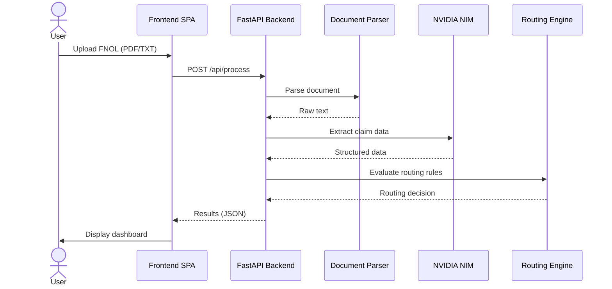

# NexusClaim

An AI based claims processing platform that automates First Notice of Loss (FNOL) document extraction and routing. Built with FastAPI, Pydantic, and NVIDIA NIM.

## Quick Start

### Prerequisites
- Python 3.8+
- NVIDIA NIM API key ([Get one free here](https://build.nvidia.com/nvidia/nim))

### Setup & Run

1. **Clone the repository:**
   ```bash
   git clone https://github.com/omnarayan814/ClaimSense.git
   cd ClaimSense
   ```

2. **Create a virtual environment:**
   ```bash
   python3 -m venv venv
   source venv/bin/activate  # On Windows: venv\Scripts\activate
   ```

3. **Install dependencies:**
   ```bash
   pip install -r requirements.txt
   ```

4. **Set up your API key:**
   ```bash
   cp .env.example .env
   # Edit .env and add your NVIDIA_API_KEY
   ```

5. **Start the development server:**
   ```bash
   python app.py
   ```
   
   Open your browser and go to `http://localhost:8000`

## How It Works



## API

### Process Claim Document
- **Endpoint:** `POST /api/process`
- **Rate Limit:** 5 requests per minute
- **Input:** PDF or TXT file (multipart/form-data)
- **Output:** Extracted claim data + routing decision

**Example Response:**
```json
{
  "claim_data": {
    "policyNumber": "POL12345",
    "incidentDate": "2023-10-15",
    "incidentDescription": "Rear-ended at a stop light.",
    "initialEstimate": 5000.0
  },
  "routing_decision": "FAST_TRACK",
  "reasoning": "Complete claim, below threshold, no fraud indicators."
}
```

## Architecture

- **Frontend:** Vanilla JavaScript SPA with hash-based routing
- **Backend:** FastAPI with sliding window rate limiting
- **LLM:** NVIDIA NIM for intelligent data extraction
- **Logic:** Deterministic rules engine for routing decisions

## Testing

Sample documents are available in `static/samples/` for testing the extraction pipeline.
